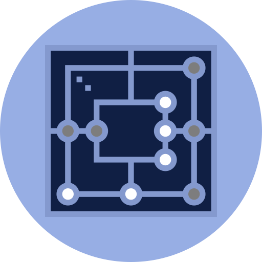

# Web Technologies | Nine Men's Morris

    

    
    
    

 

    
    
    

## Project Overview

This project involves the development of a **web-based** version of the traditional game `Nine Men's Morris`, structured in **three phases**.

1. The **first phase** focused on building a **Single-Page Application (SPA)** with core features such as an **interactive game board**, **user configuration**, **instructions**, **leaderboards**, **messaging**, and **basic AI for single-player mode**. Consequently, this phase established the **foundational gameplay** and **user interface** of the application.

2. In the **second phase**, the game was made distributed, enabling **multiplayer** functionality by integrating with a **web server** to manage **real-time client-server communication and gameplay**.

3. Finally, in the **third phase**, a **custom server** was developed using **Node.js** to replace the external server. This included implementing features like **persistent data storage**, **modular server architecture**, and **secure communication through hashing and encryption**, ensuring a robust and independent **backend** for the application.

## Project Demo

Finally, here's a **quick demo** of the final Web Application:

 <video src= "https://github.com/user-attachments/assets/d5b41125-6592-43f9-8f64-eaba62ef4500" />

## Authorship

- **Authors** &#8594; [Gonçalo Esteves](https://github.com/EstevesX10), [Nuno Gomes](https://github.com/NightF0x26) and [Pedro Afonseca](https://github.com/PsuperX)
- **Course** &#8594; Web Technologies [[CC3008](https://sigarra.up.pt/fcup/en/ucurr_geral.ficha_uc_view?pv_ocorrencia_id=548310)]
- **University** &#8594; Faculty of Sciences, University of Porto

<!--  -->

`README.md by Gonçalo Esteves`

